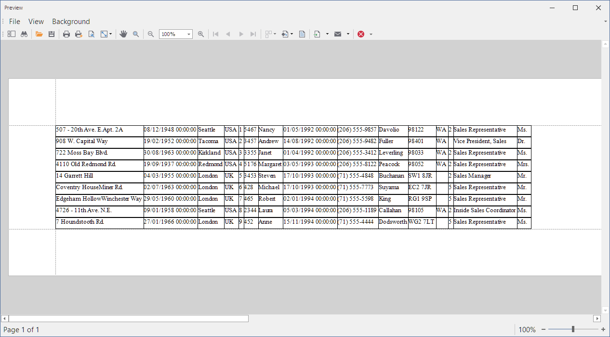

# Table Report - How to Adjust the Column Width to Best Fit the Cell Content

This example calculates the column width to display the entire cell content and adjusts the width of the table column in the resulting document.

The code in this example does the following:

- Calls the [XtraReport.CreateDocument](https://docs.devexpress.com/XtraReports/DevExpress.XtraReports.UI.XtraReport.CreateDocument) method to create a report document. A document is a collection of document [bricks](https://docs.devexpress.com/WindowsForms/88/Controls-and-Libraries/Printing-Exporting/Concepts/Basic-Terms/Bricks).
- Iterates through the brick collection to find the maximum text width per column. The `DevExpress.XtraPrinting.Native.NestedBrickIterator` class instance loops through visual bricks, and the [BestSizeEstimator](https://docs.devexpress.com/XtraReports/DevExpress.XtraReports.UI.BestSizeEstimator) class methods are used to calculate the text width. 
- Specifies the [XRTableCell.WidthF](https://docs.devexpress.com/XtraReports/DevExpress.XtraReports.UI.XRTableCell.WidthF) property.
- Re-creates the report document with the new column width.

## Files to Review

* [Form1.cs](./CS/Form1.cs) (VB: [Form1.vb](./VB/Form1.vb))
* [Program.cs](./CS/Program.cs) (VB: [Program.vb](./VB/Program.vb))
* [XtraReport1.cs](./CS/Report/XtraReport1.cs) (VB: [XtraReport1.vb](./VB/Report/XtraReport1.vb))
* [ReportHelper.cs](./CS/ReportHelper/ReportHelper.cs) (VB: [ReportHelper.vb](./VB/ReportHelper/ReportHelper.vb))

## Documentation

- [XRTable](https://docs.devexpress.com/XtraReports/DevExpress.XtraReports.UI.XRTable)
- [Use Tables](https://docs.devexpress.com/XtraReports/9741/detailed-guide-to-devexpress-reporting/use-report-controls/use-tables)
- [Hide Table Cells](https://docs.devexpress.com/XtraReports/120028/detailed-guide-to-devexpress-reporting/use-report-controls/use-tables/hide-table-cells)
- [XRLabel.AutoWidth](https://docs.devexpress.com/XtraReports/DevExpress.XtraReports.UI.XRLabel.AutoWidth)

## More Examples

- [Customizing row height at runtime to a maximum best fit value](https://github.com/DevExpress-Examples/Reporting_customizing-row-height-at-runtime-to-a-maximum-best-fit-value-e20053)